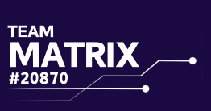

<p align="center">
  
</p>

# Team Matrix Design System

The official design system of **Team Matrix**, *FIRST*® Tech Challenge Team **#20870**, Mumbai.
Use it for the website, social posts, sponsor decks, pit banners, jerseys, the engineering portfolio and anything else the team makes.

- **Live gallery:** https://ishaanjayaswal-dotcom.github.io/team-matrix-design-system/
- **Version:** 2.0.0 (6 October 2026). Colours, fonts and gradient picked by the team.
- **Theme:** dark only. Team Matrix is always shown on very dark purple.

---

## 1. Brand in one line

Students who build serious machines. The look is dark, confident and technical: very dark purple, white headlines in tall capitals, light purple text, one violet accent.

## 2. Name

- Always **Team Matrix**. Never "Matrix" on its own.
- Team number is written **#20870** (with the hash) or **Team 20870**.
- Season: **BIOBUZZ** (2026–27). Official form: "BIOBUZZ presented by RTX".
- Write *FIRST* in capitals and italics, as FIRST does: *FIRST*® Tech Challenge. Use official FIRST and FTC logo files from [firstinspires.org/brand](https://www.firstinspires.org/brand) without changing them, and only on official team materials.

## 3. Logo

| File | Use |
| --- | --- |
| `assets/logo/team-matrix-logo-white-trimmed.png` | Default. White logo, transparent background, no empty margin. Use on any dark purple. |
| `assets/logo/team-matrix-logo-white.png` | Same, with the original margin. |
| `assets/logo/team-matrix-logo-original.png` | Original file, white on logo indigo `#1A0A41`. |

The logo is white lettering "TEAM / MATRIX / #20870" with circuit lines running to the right.

Rules:
- Only ever white, on dark purple. Never recolour it, stretch it, add effects, or put it on a light background.
- Keep empty space around it at least the height of the word "TEAM".
- Minimum width: 120px on screen, 30mm in print.
- **The current files are small (262 × 138 px).** They are fine on screens. For banners, jerseys and the robot, use the original Canva or vector file.

## 4. Colour

Five colours chosen by the team, plus a few helpers worked out from them.

| Role | Token | Hex | Notes |
| --- | --- | --- | --- |
| Main background | `--tm-bg-main` | `#0E0C14` | Team pick. Pages, slides, posts. |
| Second background | `--tm-bg-second` | `#513899` | Team pick. Cards, panels, highlighted sections. |
| Heading text | `--tm-text-heading` | `#FFFFFF` | Team pick. All headings. |
| Body text | `--tm-text-body` | `#D9D5E2` | Team pick. Running text. |
| Accent | `--tm-accent-default` | `#A58BFF` | Team pick. Buttons, links, labels on the main background. |
| Accent on second | `--tm-accent-on-second` | `#D2C4FF` | Helper. Links and labels on the second background. |
| Muted text | `--tm-text-muted` | `#A6A3AE` | Helper. Captions on the main background only. |
| Subtle background | `--tm-bg-subtle` | `#1A142C` | Helper. Inputs, table rows, quiet panels. |
| Text on accent | `--tm-text-on-accent` | `#0E0C14` | Text on accent buttons and badges. |
| Warning | `--tm-status-warning` | `#FFB547` | |
| Danger | `--tm-status-danger` | `#FF7A93` | Main background only for text. |
| Red alliance | `--tm-alliance-red` | `#FF5A6E` | Match graphics only. |
| Blue alliance | `--tm-alliance-blue` | `#4D8DFF` | Match graphics only. |

**No green, anywhere.** This includes teal and "success" green. Use violet or white with a check icon for success states.

### Readability (WCAG 2.2)

Normal text needs a contrast of at least 4.5:1. Large text, buttons and icons need 3:1. ([W3C, 1.4.3](https://www.w3.org/WAI/WCAG22/Understanding/contrast-minimum) and [1.4.11](https://www.w3.org/WAI/WCAG21/Understanding/non-text-contrast.html))

| Pair | Contrast | Result |
| --- | --- | --- |
| Heading on main | 19.4 | Pass |
| Body on main | 13.5 | Pass |
| Accent on main | 7.2 | Pass |
| Muted on main | 7.8 | Pass |
| Heading on second | 8.8 | Pass |
| Body on second | 6.1 | Pass |
| Accent on second | 3.3 | **Large text and buttons only.** Use `--tm-accent-on-second` (5.5) for small text. |
| Muted on second | 3.6 | **Do not use.** |
| Text on accent button | 7.2 | Pass |

The second background is a big step up from the main one (2.2:1). It is meant to stand out, so use it for cards and key sections, not for whole pages.

## 5. Gradient

```css
--tm-gradient-brand: radial-gradient(80% 90% at 17% 27%, #9E7CFF 0%, #3B2585 45%, #1A0A41 100%);
```

The bright spot sits top left. White text on that bright area is only 3.1:1, so put headlines and body text on the darker right or bottom part. Use the gradient for heroes, social posts, title slides and banners. Do not put it behind long text.

## 6. Typography

| Role | Font | Size | Line height | Notes |
| --- | --- | --- | --- | --- |
| Display | Bebas Neue 400 | 96px | 0.92 | Capitals only |
| H1 | Bebas Neue 400 | 68px | 0.95 | |
| H2 | Bebas Neue 400 | 48px | 1.0 | |
| H3 | Bebas Neue 400 | 34px | 1.05 | |
| H4 | Bebas Neue 400 | 25px | 1.1 | |
| Body large | Poppins 400 | 18px | 1.6 | |
| Body | Poppins 400 | 16px | 1.65 | |
| Small | Poppins 400 | 14px | 1.55 | |
| Label | Poppins 600 | 12px | 1.4 | Uppercase, 0.12em letter spacing |

Heading sizes already include the team's 105% heading scale. Both fonts are free on [Google Fonts](https://fonts.google.com) and in Canva.

Rules:
- **Bebas Neue is capitals only and has one weight.** Never bold it, never use it for sentences or body text.
- Headings are always white. Body text is always light purple `#D9D5E2`.
- Keep body text lines under about 70 characters.
- Use Poppins 600 for buttons, labels and small headings inside cards.

## 7. Space, shape and motion

- **Spacing:** 4px grid. 4, 8, 12, 16, 20, 24, 32, 40, 48, 64, 96.
- **Radius:** 6px badges and inputs, 12px buttons and cards, 20px large panels and image frames.
- **Shadow:** soft dark card shadow; violet glow on accent button hover only.
- **Motion:** 120ms taps, 220ms hovers, 400ms larger moves, ease-out. No bouncing.

## 8. Components

Class names start with `.tm-`. See them live in the [gallery](https://ishaanjayaswal-dotcom.github.io/team-matrix-design-system/).

| Component | Class | React |
| --- | --- | --- |
| Button (primary, secondary, ghost) | `.tm-btn .tm-btn--primary` | `<Button>` |
| Card on second background | `.tm-card` | `<Card>` |
| Section heading (label + heading) | `.tm-section-head` | `<SectionHeading>` |
| Stat (big number + label) | `.tm-stat` | `<Stat>` |
| Badge | `.tm-badge` | `<Badge>` |
| Honours list | `.tm-honours` | `<Honours>` |
| Sponsor tier | `.tm-tier` | `<Tier>` |
| Match score (red vs blue) | `.tm-match` | `<MatchScore>` |
| Form field | `.tm-field .tm-input` | |
| Hero with gradient | `.tm-hero` | |
| Logo | `.tm-logo` | `<Logo>` |

Button rules: on the main background, the primary button is accent violet with dark text. Inside a card or any second-background section, it turns white with purple text, because accent on the second background is too faint.

## 9. Voice

- **Lead with the robot.** Say what it does: "Our turret aims without turning the drivetrain."
- **Numbers beat adjectives.** "Ranked #1 of 46 at the India Championship", not "one of the best teams".
- **Thank people by name.** Sponsors, mentors and alliance partners, every time.
- Short sentences. Plain words. No hype.

## 10. Real examples

| Example | File |
| --- | --- |
| Website front page | [examples/website.html](examples/website.html) |
| Instagram post (1:1) | [examples/instagram-post.html](examples/instagram-post.html) |
| Sponsor slide (16:9) | [examples/sponsor-slide.html](examples/sponsor-slide.html) |
| Pit banner (4:1) | [examples/pit-banner.html](examples/pit-banner.html) |

## 11. Files

```
README.md                         this guide
index.html                        live gallery (GitHub Pages)
tokens/team-matrix.tokens.json    source of truth, W3C Design Tokens Format 2025.10
tokens/tokens.css                 CSS variables (generated)
tokens/tailwind.preset.js         Tailwind preset (generated)
css/team-matrix.css               components
components/react/TeamMatrix.jsx   React components
assets/logo/                      official logo files
examples/                         real layouts
src/gallery.html                  gallery source
build.py                          rebuilds tokens.css, the Tailwind preset and index.html
```

Tokens follow the [W3C Design Tokens Format Module 2025.10](https://www.w3.org/community/reports/design-tokens/CG-FINAL-format-20251028/), so they load into Figma (Tokens Studio), Style Dictionary and other tools.

### Use on a web page

```html
<link rel="stylesheet" href="https://ishaanjayaswal-dotcom.github.io/team-matrix-design-system/tokens/tokens.css">
<link rel="stylesheet" href="https://ishaanjayaswal-dotcom.github.io/team-matrix-design-system/css/team-matrix.css">
<body class="tm-page">
  <h1 class="tm-h1">Team Matrix</h1>
  <a class="tm-btn tm-btn--primary" href="#">Become a sponsor</a>
</body>
```

### Change something

Edit `tokens/team-matrix.tokens.json`, then run `python3 build.py` and commit.

---

Team Matrix · *FIRST*® Tech Challenge #20870 · Dhirubhai Ambani International School, Mumbai
