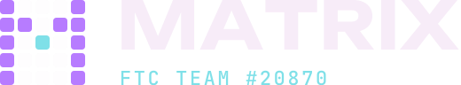

<p align="center">
  
</p>

# Team Matrix Design System

The official look of **Team Matrix, FIRST Tech Challenge #20870**, Mumbai.
Logo, colour, type, grid, components and voice, in one place.

**Live gallery:** https://ishaanjayaswal-dotcom.github.io/team-matrix-design-system/

---

## The idea

Our logo is a 5 × 5 dot matrix with the letter **M** switched on. One cell, the vertex of the M, glows aqua.
Everything else in the system snaps to that same grid:

| Unit  | Value | Used for                         |
| ----- | ----- | -------------------------------- |
| Cell  | 16px  | Base unit, logo cells, icon size |
| Gap   | 4px   | Space between cells              |
| Pitch | 20px  | Cell + gap, layout rhythm        |

## Colour

Two worlds: **Midnight** (default, dark) and **Paper** (light, for print and reports).

| Token        | Hex       | Role                          |
| ------------ | --------- | ----------------------------- |
| Midnight     | `#0C0A1A` | Default background            |
| Plum         | `#2B1648` | Raised surfaces               |
| Violet       | `#B77CFF` | Primary, the lit cell         |
| Violet Deep  | `#7B3FE4` | Primary on Paper              |
| Aqua         | `#7FE0E8` | Signal, one per layout        |
| Aqua Deep    | `#0F8C98` | Fills and icons on Paper      |
| Sand         | `#C9B999` | Honours, seasons, awards      |
| Paper        | `#F7ECF8` | Light background              |
| Ink          | `#1A0F2E` | Text on Paper                 |

Red and blue are reserved for the two FTC alliances. They are never brand colours.

## Type

| Role    | Typeface        | Use                                      |
| ------- | --------------- | ---------------------------------------- |
| Display | Unbounded       | Headlines, scores, the wordmark          |
| Body    | Instrument Sans | Everything you read                      |
| Utility | JetBrains Mono  | Labels, team numbers, timers, code       |

All three are free on Google Fonts.

## Use it on a web page

```html
<link rel="stylesheet" href="https://ishaanjayaswal-dotcom.github.io/team-matrix-design-system/tokens/tokens.css">
<link rel="stylesheet" href="https://ishaanjayaswal-dotcom.github.io/team-matrix-design-system/css/matrix.css">

<body class="mx-body">
  <h1 class="mx-h1">Team Matrix</h1>
  <a class="mx-btn mx-btn--primary" href="#">Sponsor us</a>
  <span class="mx-chip mx-chip--honor">Inspire Award</span>
</body>
```

Force a theme with `<html data-theme="dark">` or `<html data-theme="light">`. Without it, the page follows the device setting.

## Use it in Figma

Load `tokens/tokens.json` with the Tokens Studio plugin. The file uses the W3C design-token format, so it also works with Style Dictionary.

## Files

```
index.html        live gallery (GitHub Pages)
tokens/
  tokens.css      CSS variables, both themes
  tokens.json     design tokens for Figma / Style Dictionary
css/
  matrix.css      components (.mx-btn, .mx-chip, .mx-stat, .mx-honor, .mx-match, ...)
logo/
  matrix-lockup-{dark,light,mono-white,mono-black}.svg
  matrix-mark-{dark,light,mono-white,mono-black}.svg
  matrix-avatar-{dark,light}.svg     square tiles for social profiles
src/
  gallery.html    gallery source
build.py          inlines the CSS into index.html
```

All logo files are pure SVG outlines (no fonts needed), so they print sharp at any size.

## Logo rules

- Keep one pitch of empty space around the mark.
- Minimum size: 24px tall on screen, 8mm in print.
- Do not recolour the aqua cell, rotate the mark, or switch on extra cells.
- On photos, use the mono white version with a dark scrim.

## Editing the gallery

Edit `src/gallery.html`, `tokens/tokens.css` or `css/matrix.css`, then run:

```
python3 build.py
```

and commit the new `index.html`.

---

Team Matrix · FTC #20870 · Dhirubhai Ambani International School, Mumbai
